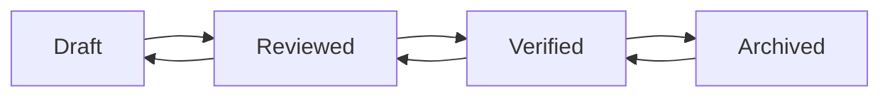

# 🧠 Personal AI Knowledge Workspace for Engineers

<div align="center">


**Local-first workspace for knowledge capture + traceable retrieval**

</div>

---

## 📖 Table of Contents

- [Overview](#-overview)
- [Key Features](#-key-features)
- [Architecture](#-architecture)
- [Quick Start](#-quick-start)
- [Core Workflows](#-core-workflows)
- [API Reference](#-api-reference)
- [Development](#-development)
- [Testing](#-testing)
- [Deployment](#-deployment)
- [Troubleshooting](#-troubleshooting)

---

## 🎯 Overview

This is a **personal AI-powered knowledge workspace** designed specifically for engineers to:

- ✅ Capture troubleshooting solutions with full context
- ✅ Index documents, screenshots, and images with OCR
- ✅ Ask AI questions with **traceable sources**
- ✅ Run automated tests that generate knowledge entries
- ✅ Build a personal knowledge graph with linked items

> ⚠️ **What this is NOT:**
> - This is **NOT** an ERP-style approval system
> - This is **NOT** just a file organizer
> - This is **NOT** a team collaboration tool (single-user focused)

---

## ✨ Key Features

### 📚 Knowledge Management
| Feature | Description |
|---------|-------------|
| **Workflow States** | `draft` → `reviewed` → `verified` → `archived` |
| **Source Tracking** | Track origin: manual, document-derived, or autotest-derived |
| **Link Graph** | Connect related items (knowledge, logbook, docs, photos, prompts) |
| **Vector Search** | Semantic search powered by ChromaDB + SentenceTransformers |

### 🔧 Problem Logbook
- Record troubleshooting sessions in real-time
- One-click promotion to verified knowledge entries
- Automatic linking to source items (documents, AutoTest runs)

### 📄 Documents & Photos
- Upload PDFs, TXT, Markdown files
- Image/screenshot upload with OCR text extraction
- Preview, download, edit metadata, archive/delete
- Full-text search indexed in vector database

### 🤖 AI Assistant
- Q&A with cited sources (document snippets, knowledge entries)
- Template generation (Bug Reports, PR Descriptions, Postmortems)
- Custom saved prompts library
- Fallback mode when LLM is unavailable (retrieval-only answers)

### 🧪 AutoTest Integration
- Upload project ZIP archives
- Automatic project type detection (Node.js / Python)
- Simulated or real test execution
- Auto-generates problem drafts on failure
- Auto-generates solution notes on success

---

## 🏗️ Architecture

```
┌─────────────────────────────────────────────────────────────┐
│                     Frontend (Vue 3 + Vite)                  │
│  ┌──────────┐ ┌──────────┐ ┌──────────┐ ┌────────────────┐ │
│  │ Activity │ │  Search  │ │Knowledge │ │    Logbook     │ │
│  │Dashboard │ │  Panel   │ │   Base   │ │     Panel      │ │
│  └──────────┘ └──────────┘ └──────────┘ └────────────────┘ │
│  ┌──────────┐ ┌──────────┐ ┌──────────┐ ┌────────────────┐ │
│  │Docs&Photo│ │ AutoTest │ │ Prompts  │ │   Generator    │ │
│  │  Panel   │ │  Panel   │ │  Panel   │ │    Panel       │ │
│  └──────────┘ └──────────┘ └──────────┘ └────────────────┘ │
└─────────────────────────────────────────────────────────────┘
                            │
                    HTTP/REST API
                            │
┌─────────────────────────────────────────────────────────────┐
│                   Backend (FastAPI + Python)                 │
│  ┌──────────┐ ┌──────────┐ ┌──────────┐ ┌────────────────┐ │
│  │   Auth   │ │   API    │ │Services  │ │  KB Indexer    │ │
│  │  (JWT)   │ │ Endpoints│ │  (QA,    │ │ (Vector DB)    │ │
│  │          │ │          │ │ Generate)│ │                │ │
│  └──────────┘ └──────────┘ └──────────┘ └────────────────┘ │
│  ┌──────────┐ ┌──────────┐ ┌──────────┐ ┌────────────────┐ │
│  │Database  │ │  LLM     │ │  Utils   │ │   AutoTest     │ │
│  │(SQLite)  │ │Providers │ │(Security,│ │   Runner       │ │
│  │          │ │(Ollama)  │ │ File I/O)│ │                │ │
│  └──────────┘ └──────────┘ └──────────┘ └────────────────┘ │
└─────────────────────────────────────────────────────────────┘
                            │
            ┌───────────────┼───────────────┐
            │               │               │
    ┌───────▼───────┐ ┌─────▼─────┐ ┌──────▼──────┐
    │   SQLite DB   │ │ ChromaDB  │ │ File System │
    │ (Metadata)    │ │(Embeddings)│ │ (Uploads)   │
    └───────────────┘ └───────────┘ └─────────────┘
```

### Tech Stack

| Layer | Technology |
|-------|------------|
| **Frontend** | Vue 3, PrimeVue, Axios, Vite |
| **Backend** | FastAPI, Pydantic, Uvicorn |
| **Database** | SQLite (metadata), ChromaDB (embeddings) |
| **LLM** | Ollama (default), Mock, Noop fallback |
| **Auth** | JWT (HS256), PBKDF2 password hashing |
| **Testing** | pytest (backend), Vitest (frontend) |
| **CI/CD** | GitHub Actions |

---

## 🚀 Quick Start

### Prerequisites

- Python 3.11+
- Node.js 20+
- Ollama (optional, for AI features)

### 1️⃣ Install Backend

```bash
cd backend
python -m pip install -r requirements.txt
cp .env.example .env
```

Edit `backend/.env`:

```bash
JWT_SECRET=your-super-secret-key-here
DEFAULT_OWNER_PASSWORD=YourSecurePassword123!
ALLOWED_ORIGINS=http://localhost:5173
DATABASE_PATH=documents.db
UPLOAD_DIR=./uploads
PHOTO_DIR=./photos
CHROMA_DB_PATH=./chroma_db
AUTOTEST_MODE=simulated
```

### 2️⃣ Start Backend

```bash
# From the backend directory
python -m uvicorn app.main:app --host 0.0.0.0 --port 8000 --reload
```

Or use the helper script from root:

```bash
./start_backend.sh
```

### 3️⃣ Install Frontend

```bash
cd frontend
npm install
```

### 4️⃣ Start Frontend

```bash
npm run dev -- --host 0.0.0.0 --port 5173
```

Or use the helper script from root:

```bash
./start_frontend.sh
```

### 5️⃣ Open the Application

Navigate to: **http://localhost:5173**

**Default Login:**
- **User ID:** `owner`
- **Password:** Value from `DEFAULT_OWNER_PASSWORD` in `backend/.env`

---

## 🔄 Core Workflows

### Knowledge Entry Lifecycle



### Promote Logbook to Knowledge

```
Logbook Entry → [Promote Button] → Knowledge Entry
                      ↓
           Creates linked copy
           with source_ref
```

### AutoTest Flow

```
Upload ZIP → Detect Project Type → Run Tests → Generate Report
                                      ↓
                    ┌─────────────────┴─────────────────┐
                    ↓                                   ↓
              Success (Passed)                    Failure (Failed)
                    ↓                                   ↓
          Create Knowledge Entry              Create Logbook Entry
          with solution hints                 with problem analysis
```

---

## 📡 API Reference

### Authentication

| Endpoint | Method | Description |
|----------|--------|-------------|
| `/api/login` | POST | Login and get JWT token |
| `/api/me` | GET | Get current user info |

### Documents

| Endpoint | Method | Description |
|----------|--------|-------------|
| `/api/docs` | GET | List all documents |
| `/api/docs/upload` | POST | Upload a new document |
| `/api/docs/{doc_id}` | PATCH | Update document metadata |
| `/api/docs/{doc_id}` | DELETE | Archive a document |
| `/api/docs/{doc_id}/download` | GET | Download document file |

### Photos

| Endpoint | Method | Description |
|----------|--------|-------------|
| `/api/photos` | GET | List all photos |
| `/api/photos/upload` | POST | Upload a new photo |
| `/api/photos/{photo_id}` | PATCH | Update photo metadata |
| `/api/photos/{photo_id}` | DELETE | Archive a photo |
| `/api/photos/{photo_id}/download` | GET | Download photo file |

### Knowledge Base

| Endpoint | Method | Description |
|----------|--------|-------------|
| `/api/knowledge/entries` | GET | List knowledge entries |
| `/api/knowledge/entries` | POST | Create new entry |
| `/api/knowledge/entries/{entry_id}` | PATCH | Update entry |
| `/api/knowledge/entries/{entry_id}` | DELETE | Archive entry |

### Logbook

| Endpoint | Method | Description |
|----------|--------|-------------|
| `/api/logbook/entries` | GET | List logbook entries |
| `/api/logbook/entries` | POST | Create new entry |
| `/api/logbook/entries/{entry_id}` | PATCH | Update entry |
| `/api/logbook/entries/{entry_id}/promote-to-knowledge` | POST | Promote to knowledge |

### AutoTest

| Endpoint | Method | Description |
|----------|--------|-------------|
| `/api/autotest/run` | POST | Run AutoTest on uploaded ZIP |
| `/api/autotest/runs` | GET | List AutoTest runs |
| `/api/autotest/runs/{run_id}` | GET | Get run details |

### AI & Templates

| Endpoint | Method | Description |
|----------|--------|-------------|
| `/api/qa` | POST | Ask AI question |
| `/api/generate` | POST | Generate from template |
| `/api/meta/templates` | GET | List available templates |
| `/api/prompts` | GET/POST/DELETE | Manage saved prompts |

### Item Links

| Endpoint | Method | Description |
|----------|--------|-------------|
| `/api/item-links?item_id=...` | GET | Get links for an item |
| `/api/items/resolve` | POST | Resolve multiple item IDs |

---

## 🛠️ Development

### Project Structure

```
enterprise_ai/
├── backend/
│   ├── app/
│   │   ├── main.py           # FastAPI app & routes
│   │   ├── models.py         # Pydantic schemas
│   │   ├── database.py       # SQLite + migrations
│   │   ├── services.py       # Business logic (QA, templates)
│   │   ├── kb_index.py       # Vector DB indexing
│   │   ├── auth.py           # JWT authentication
│   │   ├── dependencies.py   # FastAPI dependencies
│   │   ├── utils.py          # Helper functions
│   │   └── llm/
│   │       ├── factory.py    # LLM provider factory
│   │       ├── providers.py  # Ollama, Mock, Noop
│   │       └── __init__.py
│   ├── tests/
│   ├── requirements.txt
│   └── .env.example
├── frontend/
│   ├── src/
│   │   ├── App.vue
│   │   ├── main.js
│   │   ├── api.js            # Axios client
│   │   ├── auth.js           # Token management
│   │   ├── app-state.js      # State factories
│   │   └── components/       # Vue components
│   ├── tests/
│   ├── package.json
│   └── vite.config.js
├── scripts/
│   ├── smoke_check.py        # End-to-end smoke test
│   ├── check_version_consistency.py
│   └── package_release.sh    # Release packaging
├── .github/workflows/ci.yml
├── VERSION
├── README.md
├── QUICK_START.md
└── CHANGELOG.md
```

### Environment Variables

#### Backend (.env)

| Variable | Required | Default | Description |
|----------|----------|---------|-------------|
| `JWT_SECRET` | ✅ | - | Secret key for JWT signing |
| `DEFAULT_OWNER_PASSWORD` | ✅ | - | Initial owner password |
| `ALLOWED_ORIGINS` | ✅ | `http://localhost:5173` | CORS origins |
| `DATABASE_PATH` | ❌ | `documents.db` | SQLite database path |
| `UPLOAD_DIR` | ❌ | `./uploads` | Document upload directory |
| `PHOTO_DIR` | ❌ | `./photos` | Photo upload directory |
| `CHROMA_DB_PATH` | ❌ | `./chroma_db` | ChromaDB persistence path |
| `AUTOTEST_DIR` | ❌ | `./autotest_uploads` | AutoTest extraction dir |
| `AUTOTEST_MODE` | ❌ | `simulated` | `real` or `simulated` |
| `OLLAMA_BASE_URL` | ❌ | `http://localhost:11434` | Ollama API endpoint |
| `OLLAMA_MODEL` | ❌ | `llama3.1` | Ollama model name |
| `LLM_PROVIDER` | ❌ | `ollama` | Provider: `ollama`, `mock`, `fallback` |

#### Frontend

| Variable | Required | Default | Description |
|----------|----------|---------|-------------|
| `VITE_API_BASE` | ❌ | `http://localhost:8000` | Backend API URL |

---

## 🧪 Testing

### Backend Tests

```bash
cd backend
python -m pytest
```

Run with coverage:

```bash
python -m pytest --cov=app
```

### Frontend Tests

```bash
cd frontend
npm test
```

Watch mode:

```bash
npm run test:watch
```

### End-to-End Smoke Test

Start backend first, then:

```bash
python scripts/smoke_check.py --password "YourOwnerPassword"
```

This validates:
- ✅ Login flow
- ✅ Document listing
- ✅ Logbook creation
- ✅ Promote to knowledge
- ✅ AutoTest execution
- ✅ QA with source verification

### CI Pipeline

The GitHub Actions workflow runs:
1. Backend pytest
2. Frontend tests + build
3. Version consistency check
4. Release package creation
5. Smoke test against live server

---

## 📦 Deployment

### Building for Production

#### Frontend

```bash
cd frontend
npm run build
# Output: frontend/dist/
```

#### Backend

```bash
cd backend
# No build step needed (Python)
# Ensure all dependencies are installed
pip install -r requirements.txt
```

### Release Packaging

```bash
bash scripts/package_release.sh ./enterprise_ai_release.zip
```

This creates a zip containing:
- ✅ Backend code (excludes `.env`, `*.db`, uploads)
- ✅ Frontend built assets (excludes `node_modules`)
- ✅ Scripts and documentation
- ✅ Excludes: `.git`, caches, temporary files

### Docker (Future)

Docker support is planned for future releases.

---

## 🔧 Troubleshooting

### Common Issues

#### 1. JWT_SECRET Error

```
RuntimeError: JWT_SECRET is required.
```

**Solution:** Set `JWT_SECRET` in `backend/.env` with a random secure string.

#### 2. Port Already in Use

```
Address already in use
```

**Solution:** Change port in uvicorn command or kill existing process:

```bash
lsof -ti:8000 | xargs kill -9  # macOS/Linux
```

#### 3. Frontend Cannot Connect to Backend

**Solution:** 
- Verify backend is running on port 8000
- Check `VITE_API_BASE` in frontend environment
- Ensure CORS settings allow frontend origin

#### 4. Ollama Connection Failed

**Solution:**
- Install Ollama: https://ollama.ai
- Start Ollama service: `ollama serve`
- Pull model: `ollama pull llama3.1`
- Or set `LLM_PROVIDER=mock` for testing

#### 5. ChromaDB Import Error

```
ModuleNotFoundError: No module named 'chromadb'
```

**Solution:** Reinstall backend dependencies:

```bash
pip install -r backend/requirements.txt --force-reinstall
```

### Debug Mode

Enable verbose logging:

```bash
# In backend/.env
LOG_LEVEL=DEBUG
```

---

## 📄 License

MIT License - See LICENSE file for details.

---

## 🤝 Contributing

Contributions are welcome! Please:

1. Fork the repository
2. Create a feature branch
3. Make your changes
4. Run tests (`pytest` + `npm test`)
5. Submit a pull request

---

## 📈 Roadmap

- [ ] Multi-user support with role-based access
- [ ] Docker containerization
- [ ] Advanced search filters
- [ ] Export knowledge as PDF/Markdown
- [ ] Browser extension for quick capture
- [ ] Mobile-responsive UI improvements

---

<div align="center">

**Built with ❤️ for engineers who love solving problems**

</div>
