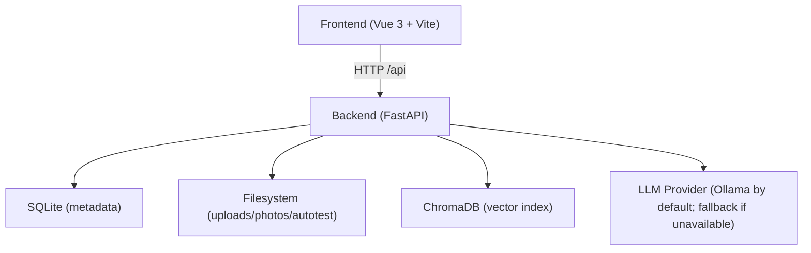

# Knowledge Workspace

Local-first, single-user workspace for engineers to capture troubleshooting knowledge, index docs & screenshots, and retrieve answers with traceable sources.

## Highlights

- **Knowledge + Logbook workflow**: draft → reviewed → verified → archived
- **Traceable retrieval**: QA responses include source snippets (documents + notes)
- **Linked items graph**: connect knowledge, logbook, docs, photos, prompts, autotest runs
- **AutoTest ingestion**: upload a project zip, run a basic pipeline, save structured results
- **Clean delivery**: CI runs backend tests + frontend tests/typecheck/build + release zip packaging

## Architecture



Notes:
- Vector indexing uses a **lightweight deterministic embedding** implementation for reproducibility in clean environments.
- OCR is optional and controlled by backend env (`OCR_ENABLED`).

## Quick Start (Demo)

Prereqs:
- Python **3.11+**
- Node.js **20+**

### 1) Backend

```bash
cd backend
python -m pip install -r requirements.txt
cp .env.example .env
```

Edit `backend/.env` (minimum required):

```env
JWT_SECRET=<32+ chars random>
DEFAULT_OWNER_PASSWORD=<your password>
ALLOWED_ORIGINS=http://localhost:5173
```

Start:

```bash
python -m uvicorn app.main:app --host 0.0.0.0 --port 8000 --reload
```

### 2) Frontend

```bash
cd frontend
npm ci
npm run dev -- --host 0.0.0.0 --port 5173
```

Open:
- `http://localhost:5173`
- Login user id: `owner`
- Password: `DEFAULT_OWNER_PASSWORD`

### 3) Smoke check

```bash
python scripts/smoke_check.py --password "<DEFAULT_OWNER_PASSWORD>"
```

## Configuration (Backend)

All backend paths are resolved consistently via `backend/app/core/config.py`:
- Relative paths are resolved **relative to `backend/`** (not the current working directory).

Key environment variables:
- `JWT_SECRET` (required, **min 32 chars**)
- `DEFAULT_OWNER_PASSWORD` (required to seed initial `owner`)
- `DATABASE_PATH` (default: `documents.db`)
- `UPLOAD_DIR` (default: `uploads/`)
- `PHOTO_DIR` (default: `photos/`)
- `CHROMA_DB_PATH` (default: `chroma_db/`)
- `AUTOTEST_DIR` (default: `autotest_uploads/`)
- `AUTOTEST_MODE` (`real` or `simulated`)
- `ALLOWED_ORIGINS` (comma-separated)
- `OCR_ENABLED` (`true/false`)
- `LLM_PROVIDER` (`ollama`, `mock`, `fallback`)
- `OLLAMA_BASE_URL` (default: `http://localhost:11434`)
- `OLLAMA_MODEL` (default: `llama3.1`)

## Developer Commands

Backend:

```bash
cd backend
python -m pytest
```

Frontend:

```bash
cd frontend
npm test
npm run typecheck
npm run build
```

Release zip:

```bash
python scripts/package_release.py ./knowledge_workspace_release.zip
```

## Release Packaging Hygiene

The release zip is built from a clean staging directory and excludes:
- `.git/`
- `node_modules/`
- `__pycache__/`, `.pytest_cache/`, `.pytest-tmp/`
- `backend/uploads/`, `backend/photos/`, `backend/autotest_uploads/`, `backend/chroma_db/`
- any `.env` files and any `*.db`

## Security Notes

- No default secrets: the backend refuses to start without a real `JWT_SECRET`.
- The initial `owner` account is seeded only when the database is empty and requires `DEFAULT_OWNER_PASSWORD`.
- AutoTest execution can be forced into `simulated` mode (recommended for CI/demo).
